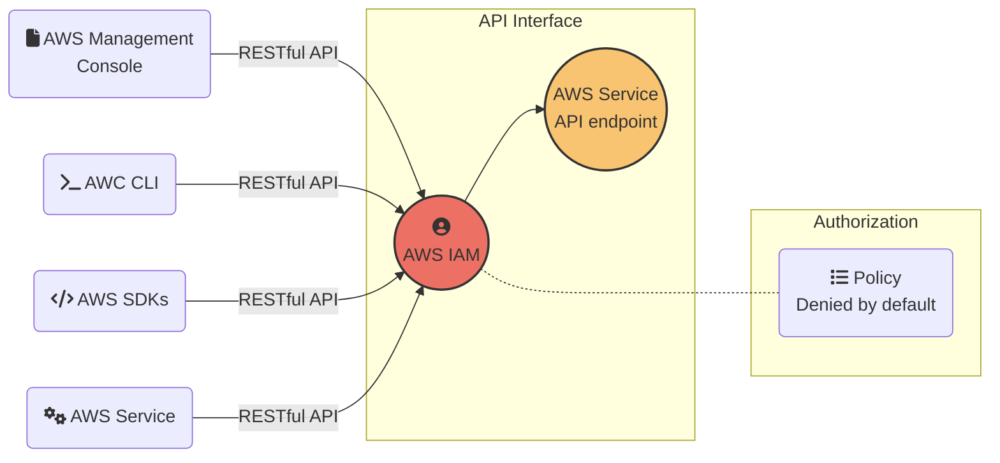

# Interacting with AWS

```mermaid
graph LR

  A("fa:fa-file AWS Management <br> Console")
  B(fa:fa-terminal AWC CLI)
  C(fa:fa-code AWS SDKs)
  D(fa:fa-cogs AWS Service)

  E((AWS Service <br/> API endpoint))
  F((fa:fa-user-circle<br>AWS IAM))

  A -->|RESTful API| F
  B -->|RESTful API| F
  C -->|RESTful API| F
  D -->|RESTful API| F
  subgraph API Interface
  F --> E
  end

  subgraph policy [Authorization]
    F ..- G(fa:fa-list Policy <br> Denied by default)
  end

  style E fill:#F8C471,stroke:#333,stroke-width:2px
  style F fill:#EC7063,stroke:#333,stroke-width:2px
```

