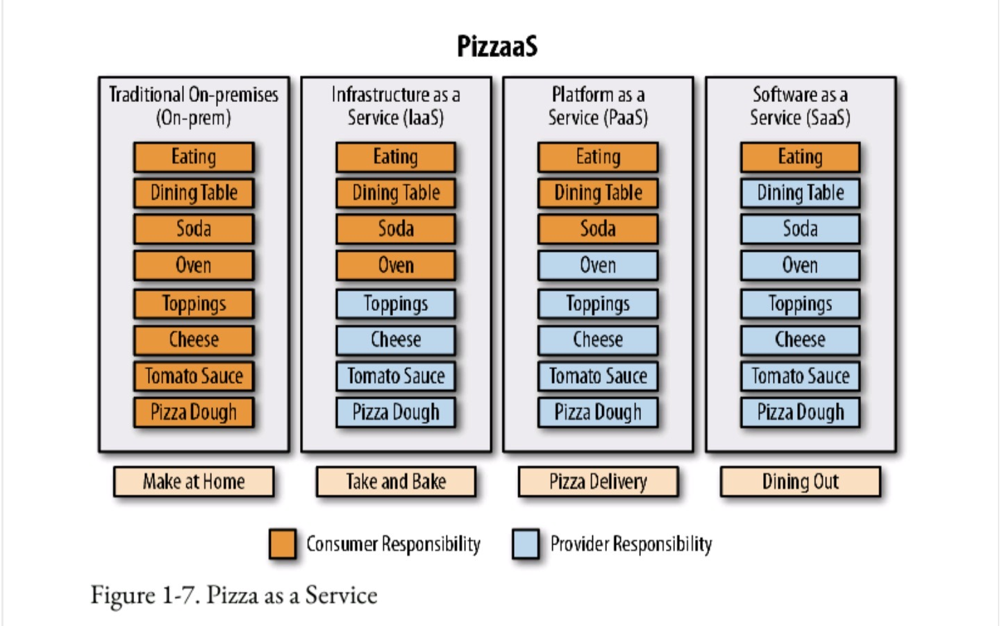
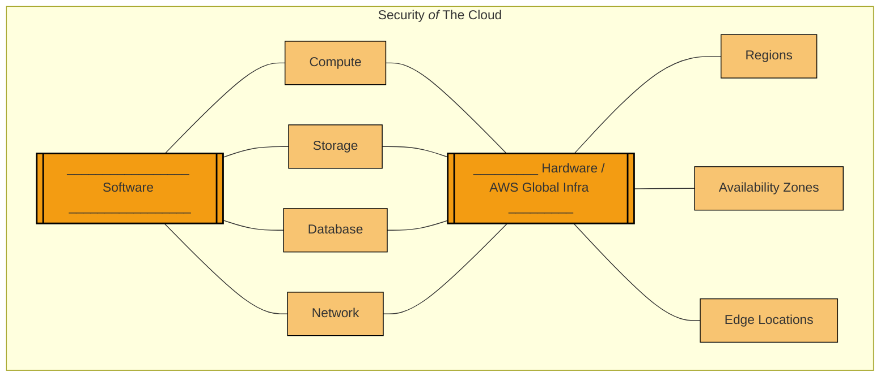
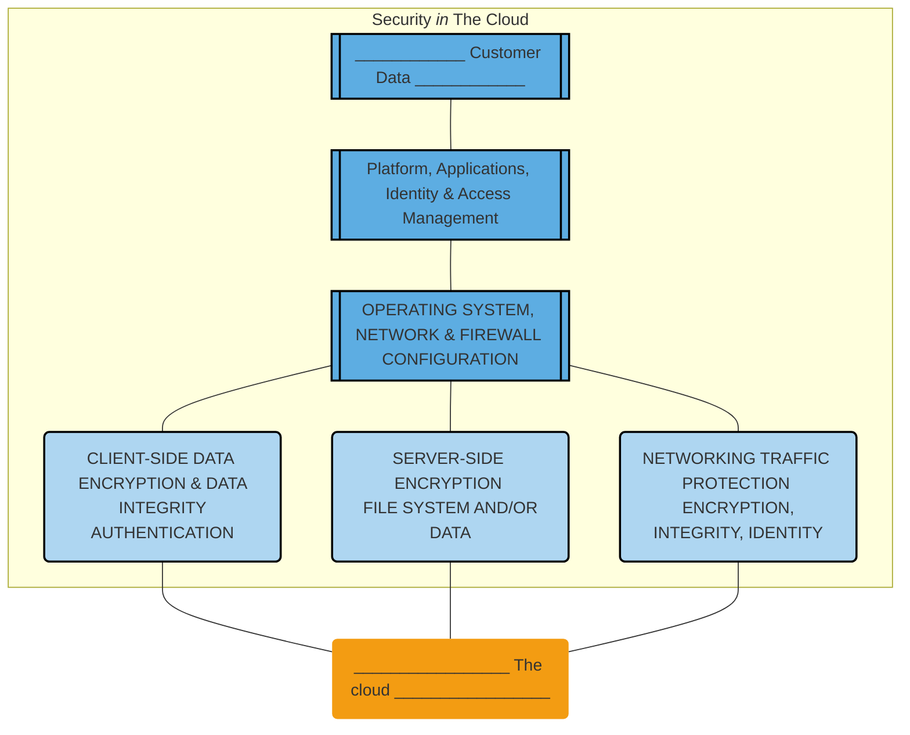

# Pizza as Service

# AWS shared responsibility model

- Security of the cloud
- Security in the cloud

# AWS shared responsibility model

<!-- Presenter Note

This slide provides a high-level overview of the AWS shared responsibility model. AWS is responsible for protecting the global infrastructure that runs all of the services offered in the AWS Cloud. This infrastructure comprises the hardware, software, networking, and facilities that run AWS services.

-->

# AWS shared responsibility model

<!-- Presenter Note

As an AWS customer, you can securely provision virtual servers, storage, databases, and desktops in the AWS Cloud. In this process, you are responsible for securing your data, operating systems, networks, platforms, and other resources that you create in the AWS Cloud. You are responsible for protecting the confidentiality, integrity, and availability of your data in the cloud. You must also meet any specific business and/or compliance requirements for your workloads in the cloud. As previously mentioned, this course looks at how AWS deals with security OF the cloud and how you can take care of security IN the cloud.

For more information about the AWS shared responsibility model, see https://aws.amazon.com/compliance/shared-responsibility-model/.

-->
