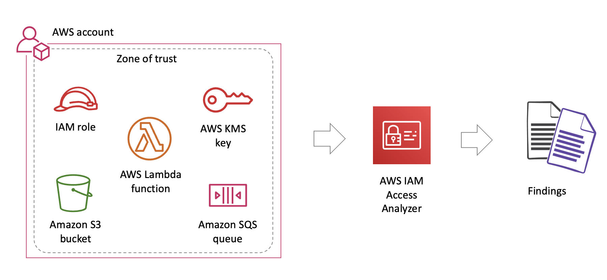

# IAM Access Analyzer

- Access Analyzer helps **identify resources** in your organization and accounts that are shared with an external entity.
- Access Analyzer **validates IAM policies** against policy grammar and best practices.
- Access Analyzer **generates IAM policies** based on access activity in your AWS CloudTrail logs.

# IAM Access Analyzer

# S3 Access Analyzer

- Monitors Amazon S3 bucket resource access policies
- Provides alerts regarding buckets shared outside of your account
- Based on the AWS IAM Access Analyzer
- Available at no additional cost

<!--

Amazon S3 Access Analyzer monitors your resource access policies, ensuring that the policies provide only the intended access to your Amazon S3 resources. Access Analyzer for S3 evaluates your bucket access policies and enables you to discover and swiftly remediate buckets with potentially unintended access. As your organization and workloads grow, Access Analyzer for S3 will evaluate all of your policies to alert you to buckets that are shared outside of your AWS account and are at risk of unintended access.

Access Analyzer for S3 is available at no additional cost in the S3 console in all commercial AWS Regions, excluding the AWS China (Beijing) Region and the AWS China (Ningxia) Region. Access Analyzer for S3 is also available through APIs in the AWS GovCloud (US) Regions. Before you get started with S3 Access Analyzer, visit the IAM console to enable the AWS IAM Access Analyzer. When you do this, Access Analyzer for S3 will automatically be visible in the S3 console, and you will begin to see findings and insights about your buckets.

-->

# Access Analyzer

Demo

<!--

- enable access analyzer
- share the result and explain the findings
- show s3 access analyser

-->
