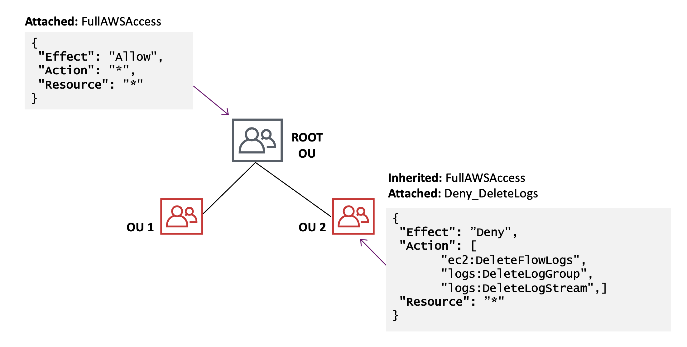

# Permission Boundaries


Developer --> Lambda

```
lambda:*
iam:PassRole
```

# Permission Boundaries


Developer --> Lambda --> S3

Lambda needs:

```
s3:Get*
s3:List*
```

# Permission Boundaries


Developer --> Lambda --> ec2

```
ec2:Describe*
ec2:Get*
```


# Permission Boundaries


Developer --> Lambda

```
lambda:*
iam:PassRole
iam:CreatePolicy
iam:CreateRole
iam:UpdateRole
iam:AttachRolePolicy
iam:Get*
iam:List*
```


# Permission Boundaries


What can go wrong?

Demo


# Permission Boundaries


```
lambda:*                   Boundry Policy
iam:PassRole               s3:Get*
iam:CreatePolicy           s3:List*
iam:CreateRole             ec2:Describe*
iam:UpdateRole             ec2:Get*
iam:AttachRolePolicy
iam:Get*
iam:List*
```

# Permission Boundaries


Demo


# Service Control Policies (SCP)


Offers policy-based, central management for multiple AWS accounts

- Organize AWS accounts into logical groups called organization units (OUs)
- Manage policies across accounts
- Automate creation of new accounts through APIs
- Consolidated Billing and All Feature modes 

# Service Control Policies (SCP)


1. Create an Organization
2. Create Organization Units
3. Add/Create AWS accounts
4. Create/Assign SCPs

# Service Control Policies (SCP)


# Service Control Policies (SCP)



<!-- 

As mentioned earlier, an SCP is a policy that specifies the services and actions that users and roles can use in the accounts that the SCP affects. SCPs are similar to IAM permission policies, except that they don't grant any permissions. Instead, SCPs are filters that allow only the specified services and actions to be used in affected accounts. Even if a user is granted full administrator permissions with an IAM permission policy, any access that is not explicitly allowed or that is explicitly denied by the SCPs affecting that account is blocked. 

By default, AWS Organizations attaches an AWS managed policy called FullAWSAccess to all roots, OUs, and accounts. This ensures that as you build your organization, nothing is blocked until you want it to be. In other words, by default all permissions are allow listed. When you are ready to restrict permissions, you replace the FullAWSAccess policy with one that allows only the more limited, desired set of permissions. Users and roles in the affected accounts can then exercise only that level of access, even if their IAM policies allow all actions. This slide shows the default FullAWSAccess policy at the root, which is inherited by the child OUs. Then you attach another SCP to deny users and roles to delete certain logs.

For more information on using service control policies to set permission guardrails across accounts, see https://aws.amazon.com/blogs/security/how-to-use-service-control-policies-to-set-permission-guardrails-across-accounts-in-your-aws-organization/

-->