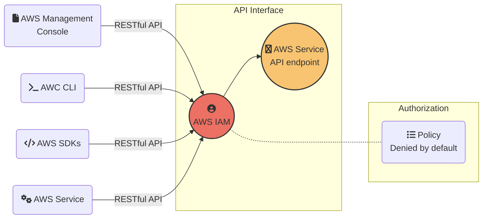
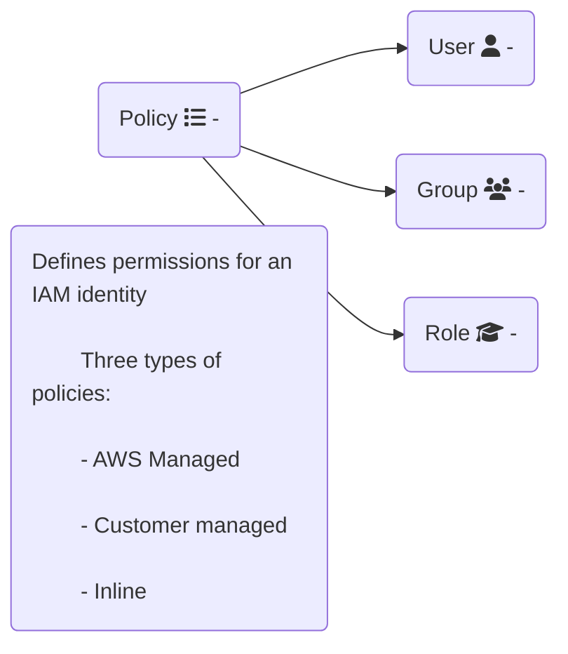

# Interacting with AWS



<!-- Presenter Note

AWS has strategically placed a limited number of access points to the cloud. This allows for more comprehensive monitoring of inbound and outbound communications and network traffic. These user access points are called API endpoints. The AWS Management Console is a web interface that you can use from standard browsers and provides functionality with the majority of the features.

The AWS Command Line Interface (AWS CLI) is a tool that promotes automation by offering commands for a broad set of AWS products.

AWS Software Development Kits (SDKs) abstract APIs into easily consumable functions that are specific to a programming language or platform. AWS also supports a variety of open-source and third-party tools that generate RESTful HTTP(S) API requests.

Other AWS services may also create API calls to a specific AWS service API endpoint.

Everything you do on AWS, whether you’re using the console, the AWS CLI, or one of the AWS SDKs, requires API calls. What you’re basically doing is sending an API request to an AWS service API endpoint. Even when an AWS service talks to another service, it’s through API calls. Let’s say you’re using the console to create an Amazon Simple Storage Service (Amazon S3) bucket. The createbucket API request is made to that service’s API endpoint. But before the request gets there, it’s authenticated and authorized by AWS IAM. Every inbound call to AWS is verified for the authentication of the caller’s credentials and the authorization of the requested action. It’s your responsibility to protect your data and resources in the cloud. However, AWS makes this task much more manageable by offering services like AWS IAM to help you along the way.

All of the API endpoints support HTTPS, using TLS encryption during the transmission to protect your request or the response from being viewed in transit. HTTP is also permitted for some services, but it is strongly advised to use HTTPS only. No matter the means used to access AWS, each API request is verified and recorded as it crosses the API interface, as displayed on the slide.

-->


# AWS Identity and Access Management (IAM)


Securely control access to your AWS resources

- Assign granular permissions to users, groups, or roles
- Share temporary access to your AWS account
- Federate users in your corporate network or with an internet identity provider

<!--

AWS IAM is a web service that helps you securely control access to AWS resources for your users. Use IAM to control who can use your AWS resources (authentication), what resources they can use, and in what ways (authorization). IAM allows you to grant granular permission to entities such as a user, group, or role. This enables them to administer and use resources in your AWS account without having to share your password or access key.

You can grant different permissions to different people for different resources. For example, you might allow some users complete access to Amazon Elastic Compute Cloud (Amazon EC2), Amazon S3, and other AWS services. For other users, you can allow read-only access to just some S3 buckets, permission to administer just some EC2 instances, or access to your billing information but nothing else. With IAM, you can also allow users who already have passwords elsewhere. For example, users with passwords in your corporate network or with an internet identity provider can get access to your AWS account.

 -->

# AWS IAM identities

 

 AWS IAM user

- Allows operators to sign in to the AWS Management Console or make programmatic requests to AWS
- Grant permissions by making users members of a group or by directly assigning permissions.

<!--

An IAM user is an entity that you create in AWS. The IAM user represents a person who interacts with AWS. A primary use for IAM users is to give people the ability to sign in to the AWS Management Console for interactive tasks and to make programmatic requests to AWS services using the API or CLI.

A user in AWS consists of a name, a password to sign into the AWS Management Console, and up to two access keys, which can be used with the API or CLI. When you create an IAM user, you grant it permissions by making it a member of a group that has appropriate permissions policies attached (recommended) or by directly assigning permissions to the user. You can also clone the permissions of an existing IAM user. This automatically makes the new user a member of the same groups and attaches all the same policies.

-->

# AWS IAM identities

 

 AWS IAM group

- Collection of IAM users with the same permissions
- A group can contain many users, and a user can belong to multiple groups
- Makes it easier to manage users and permissions at scale

<!-- Presenter Note

An IAM group is a collection of IAM users. Use groups to specify permissions for a collection of users, which can make those permissions easier to manage for those users. For example, you could have a group called Admins and give that group the types of permissions that administrators typically need. Any user in that group automatically has the permissions that are assigned to the group. If a new user joins your organization and should have administrator privileges, you can assign the appropriate permissions by adding the user to that group. Similarly, if a person changes jobs in your organization, instead of editing that user's permissions, you can remove them from the old groups and add them to the appropriate new groups.

Following are some important characteristics of groups:
- A group can contain many users, and a user can belong to multiple groups.
- Groups can't be nested; they can contain only users, not other groups.
- There's no default group that automatically includes all users in the AWS account. If you want to have a group like that, you must create it and assign each new user to it.
- There's a limit to the number of groups you can have (300) and a limit to how many groups a user can be in.

https://aws.amazon.com/premiumsupport/knowledge-center/iam-increase-policy-size/

-->

# AWS IAM identities


AWS IAM role

- Provides temporary AWS credentials to trusted users, applications, or services
- An alternative to embedding keys within an app
- Grants access to users who already have identities defined outside of AWS


<!--

An IAM role does not have any credentials (password or access keys) associated with it, like an IAM user does. Instead of being uniquely associated with one person, a role is intended to be assumable by anyone who needs it. You can use roles to delegate access to users, applications, or services that don't normally have access to your AWS resources. For example, you might want to grant users in your AWS account access to resources they don't usually have or grant users in one AWS account access to resources in another account. Or you might want to allow a mobile app to use AWS resources, but you don’t want to embed AWS keys within the app (where they can be difficult to rotate and where users can potentially extract them).

Sometimes you want to give AWS access to users who already have identities defined outside of AWS, such as in your corporate directory. Or you might want to grant access to your account to third parties so that they can perform an audit on your resources. A benefit of temporary credentials is that they expire automatically after a set period of time. You have control over the duration that the credentials are valid.

Roles can be used by the following:
- An IAM user in the same AWS account as the role
- An IAM user in a different AWS account than the role
- A web service offered by AWS such as Amazon EC2
- An external user authenticated by an external identity provider (IdP) service that is compatible with SAML 2.0 or OpenID Connect, or a custom-built identity broker

-->


# User vs Role

 

- People need to work in your account on a regular basis.
- You need to use the CLI to work with AWS.


- Applications need to make requests to AWS.
- People require temporary access to your account.
- You need to allow users to federate into your account.

<!--

Because an IAM user is just an identity with specific permissions in your account, you might not need to create an IAM user for every occasion on which you need credentials.

In many cases, you can take advantage of IAM roles and their temporary security credentials instead of using the long-term credentials associated with an IAM user. You may want to create an IAM user if other people in your group need to work in your AWS account on a daily basis. Create IAM users for the individuals who need access to your AWS resources, assign appropriate permissions to each user, and give each user his or her own credentials. AWS strongly recommends that you never share credentials among multiple users. Also, if you want to use the CLI to work with AWS, you require credentials that are only attainable via IAM users. Create an IAM user and give that user permissions to run the CLI commands you need. Then, configure the CLI on your computer to use the access key credentials associated with that IAM user.

An IAM role would be better suited for situations where you're creating an application that runs on an Amazon EC2 instance and makes requests to AWS. You should not create an IAM user and pass the user's credentials to the application or embed the credentials in the application. Instead, create an IAM role, which you attach to the EC2 instance to give temporary security credentials to applications running on the instance.

When an application uses these credentials in AWS, it can perform all of the operations that are allowed by the permissions assigned to the role. Another opportunity to use IAM roles is when you're creating an app that runs on a mobile phone and that makes requests to AWS. You should not create an IAM user and distribute the user's access key with the app. Instead, use an IdP like Login with Amazon, Amazon Cognito, Facebook, or Google to authenticate users and map the users to an IAM role.

Another use for IAM roles is to provide temporary access to your account for a specific task that is not on a regular basis. For example, every year you may have an auditor looking at certain aspects of your account. In this case, you want to create a role for this person with only the permissions required for the person to do their job. Also, if you have users in your company who are authenticated in your corporate network and want to be able to use AWS without having to sign in again, IAM roles allow you to federate these users into AWS.

-->

# AWS IAM Policy



<!--
You manage access in AWS by creating policies and attaching them to IAM identities or AWS resources. An identity-based policy is an object in AWS that, when associated with an IAM identity, defines their permissions. AWS evaluates these policies when a principal entity (user or role) makes a request. Permissions in the policies determine whether the request is allowed or denied. Most policies are stored in AWS as JSON documents.

For example, if a policy allows the GetUser action, then a user with that policy can get user information from the AWS Management Console, the AWS CLI, or the AWS API. When you create an IAM user, you can choose to allow console or programmatic access. If console access is allowed, the IAM user can sign in to the console with a user name and password. Or if programmatic access is allowed, the user can use access keys to work with the CLI or API.

Identity-based policies come in two flavors: managed and inline. Managed policies are standalone policies that you can attach to multiple users, groups, and roles in your AWS account. You can use two types of managed policies. AWS managed policies are created and managed by AWS. If you are new to using policies, AWS recommends that you start by using AWS managed policies.


Customer managed policies are policies that you create and manage in your AWS account. Customer managed policies provide more precise control over your policies than AWS managed policies. You can create and edit an IAM policy in the visual editor or by creating the JSON policy document directly. Inline policies are embedded directly into a single user, group, or role. In most cases, AWS doesn’t recommend using inline policies. Inline policies are useful if you want to maintain a strict one-to-one relationship between a policy and the principal entity that it's applied to. For example, if you want to be sure that the permissions in a policy are not inadvertently assigned to a principal entity other than the one they're intended for.
-->

# AWS IAM Policy

```yaml
Version: '2012-10-17'
Statement:
  - Effect: Allow
    Action:
      - iam:Get*
      - iam:List*
    Resource: '*'
```

# AWS IAM Policy

```json
{
    "Version": "2012-10-17",
    "Statement": [
        {
            "Effect": "Allow",
            "Action": [
                "iam:Get*",
                "iam:List*"
            ],
            "Resource": "*"
        }
    ]
}
```

# AWS IAM Policy

```yaml
Version: '2012-10-17'
Statement:
  - Effect: Allow
    Action:
      - s3:*
      - s3-object-lambda:*
    Resource: '*'
```

# AWS IAM Policy


[reference](https://docs.aws.amazon.com/IAM/latest/UserGuide/reference_policies_evaluation-logic.html)
