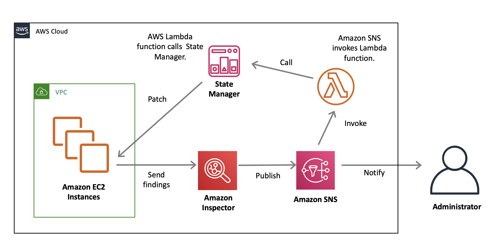

# Amazon Inspector

Automated assessments that help improve security and compliance of applications

- Detects vulnerabilities
- Verifies security best practices
- Generates findings report
- Offers both agent-based and agent-less solutions

<!--

Amazon Inspector is an automated security assessment service that helps improve the security and compliance of applications deployed on AWS. Amazon Inspector automatically assesses applications for vulnerabilities or deviations from best practices. After performing an assessment, Amazon Inspector produces a detailed list of security findings prioritized by level of severity. These findings can be reviewed directly or as part of detailed assessment reports which are available via the Amazon Inspector console or API. Amazon Inspector is an agent-based service where you deploy the Amazon Inspector agent on the Amazon EC2 Instances running the applications you want to assess.

Amazon Inspector also offers agentless network assessments with the Network Reachability rules package, which identifies ports and services on your Amazon EC2 instances that are accessible from outside your VPC.

-->

# Amazon Inspector

Amazon Inspector rules packages

- Common Vulnerabilities and Exposures
- CIS Operating System Security Configuration Benchmarks
- Security Best Practices
- Network Reachability

[https://docs.aws.amazon.com/inspector/latest/userguide/inspector_rule-packages.html](https://docs.aws.amazon.com/inspector/latest/userguide/inspector_rule-packages.html)

<!--
Described below are the Amazon Inspector rules packages currently available:

- Common Vulnerabilities and Exposures – The rules in this package help verify whether the EC2 instances in your assessment targets are exposed to common vulnerabilities and exposures (CVEs). Attacks can exploit unpatched vulnerabilities to compromise the confidentiality, integrity, or availability of your service or data. The CVE system provides a reference method for publicly known information security vulnerabilities and exposures. For more information, see https://cve.mitre.org

- CIS Operating System Security Configuration Benchmarks – The CIS Security Benchmarks program provides well-defined, un-biased and consensus-based industry best practices to help organizations assess and improve their security. AWS is a CIS Security Benchmarks Member company.

- Security Best Practices – The rules in this package help determine whether your systems are configured securely.

- Network Reachability – The rules in this package analyze your network configurations to find security vulnerabilities of your EC2 instances. The findings that Amazon Inspector generates also provide guidance about restricting access that is not secure. The findings generated by these rules show whether your ports are reachable from the internet through an internet gateway (including instances behind Application Load Balancers or Classic Load Balancers), a VPC peering connection, or a VPN through a virtual gateway. These findings also highlight network configurations that allow for potentially malicious access, such as mismanaged security groups, ACLs, IGWs, and so on.

For more information on Amazon Inspector Rules, see https://docs.aws.amazon.com/inspector/latest/userguide/inspector_rule-packages.html.

-->

# AWS System Manager

Centrally manage the security and hardening of your applications and OS

- System inventory
- OS patch updates
- Automated AMI creation
- OS and application configuration
- Session manager

<!-- 

AWS recommends centrally managing the security of your operating systems and applications running on EC2 instances in a single secure build repository. In doing so, you can develop configuration standards that address all known security vulnerabilities and are consistent with industry-accepted system-hardening standards. 

AWS Systems Manager (SSM) is a collection of capabilities that helps you automate management tasks such as collecting system inventory, applying operating system patches, automating the creation of AMIs, and configuring operating systems and applications at scale. Systems Manager lets you remotely and securely manage the configuration of your managed instances.

The Session Manager feature allows the user to secure and audit instance management without the need to open inbound ports, maintain bastion hosts, or manage SSH keys.

-->

# Amazon Inspector

Use Case 

[https://aws.amazon.com/blogs/security/how-to-remediate-amazon-inspector-security-findings-automatically/](https://aws.amazon.com/blogs/security/how-to-remediate-amazon-inspector-security-findings-automatically/)

<!-- 

As an AWS-built service, Amazon Inspector is designed to exchange data and interact with other core AWS services not only to identify potential security findings, but also to automate addressing those findings. Using Amazon Inspector with AWS Lambda allows you to automate certain security tasks. Even better, you can take actions on EC2 instances in response to Amazon Inspector findings by using Lambda to invoke Systems Manager. This enables you to take instance-specific actions based on issues that Amazon Inspector finds. Combining these capabilities allows you to build event-driven security automation to help better secure your AWS environment in near real time.

The slide illustrates a solution that automatically remediates findings generated by Amazon Inspector. To get started, you must first run an assessment and publish any security findings to an Amazon Simple Notification Service (Amazon SNS) topic. Then, you create an AWS Lambda function that is invoked by those notifications. Finally, the Lambda function examines the findings, and then implements the appropriate remediation based on the type of issue.

Here, there’s a common vulnerability and exposure (CVE) for a missing update and use AWS Lambda to call Systems Manager to update the instance via State Manager. However, this is just one use case and the underlying logic can be used for multiple cases such as software and application patching, kernel version updates, security permissions and roles changes, and configuration changes.

For more information on the solution displayed here, including configuration details, see
https://aws.amazon.com/blogs/security/how-to-remediate-amazon-inspector-security-findings-automatically/.

-->

# Amazon Inspector

Demo 

Lab 4 - Using SSM and Amazon Inspector