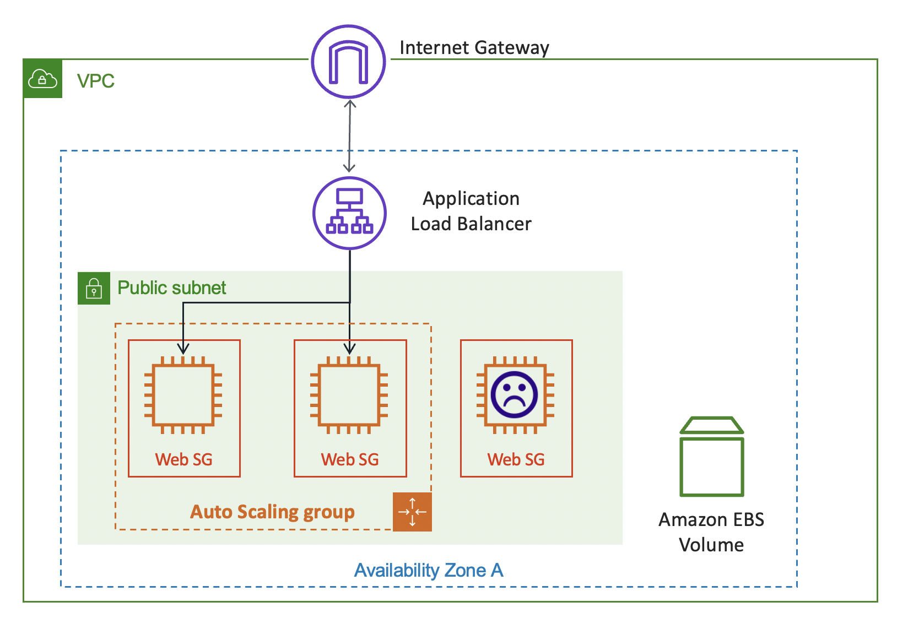

# VPC Security

<!-- Presenter Note

AWS provides a range of networking services that enable you to create a logically isolated network that you define, establish a private network connection to the AWS Cloud, use a highly available and scalable DNS service, and deliver content to your end users with low latency at high data transfer speeds with a content delivery web service. Security features within Amazon VPC include security groups, network access control lists (ACLs), routing tables and subnets, and gateways. Each of these items is complementary to providing a secure, isolated network that can be extended through selective enabling of direct Internet access or private connectivity to another network. ELB devices also assist in the overall security of the VPC. Amazon EC2 instances running within an Amazon VPC inherit all of the VPC security benefits described above. In this section, we will review each one of the items displayed here.

You can use a NAT (Network Address Translation) device to enable instances in a private subnet to connect to the internet (for example, for software updates) or other AWS services, but prevent the internet from initiating connections with the instances. A NAT device forwards traffic from the instances in the private subnet to the internet or other AWS services, and then sends the response back to the instances. When traffic goes to the internet, the source IPv4 address is replaced with the NAT device’s address and similarly, when the response traffic goes to those instances, the NAT device translates the address back to those instances’ private IPv4 addresses.

AWS offers two kinds of NAT devices: a NAT gateway and a NAT instance. We recommend NAT gateways, as they provide better availability and bandwidth over NAT instances. The NAT gateway service is also a managed service that does not require your administration efforts. A NAT instance is launched from a NAT AMI. You can choose to use a NAT instance for special purposes.

For more information on NAT devices used by AWS, see https://docs.aws.amazon.com/AmazonVPC/latest/UserGuide/vpc-nat-gateway.html.

-->

# VPC Security

Security Groups

- Acts as a virtual firewall for instances
- Stateful protection
- Only allow ingress and egress rules
- Configuration is needed to allow communication

<!--

A security group acts as a virtual firewall for your instance to control inbound and outbound traffic. When you launch an instance in a VPC, you must specify a security group for the instance. If you don't specify a particular group at launch time, the instance is automatically assigned to the default security group for the VPC. Security groups are stateful: responses to allowed inbound traffic are allowed to flow outbound regardless of outbound rules, and vice versa. For example, if you allow traffic on incoming port 80, the outgoing port 80 will be automatically opened. Traffic can be restricted by IP protocol, service port, and source/destination IP address.

For each security group, you add rules that control the inbound traffic to instances and a separate set of rules that control the outbound traffic. No inbound traffic is allowed until you configure inbound rules to your desired security group. If don’t specify a configured security group for your instance, AWS will assign your instance a default security group that will allow traffic to any other instance that is assigned the default security group. You can remove the default rule and add outbound rules that allow specific outbound traffic only. You can specify only Allow rules, but not Deny rules.

You can have up to 50 ingress and 50 egress rules per security group. If you have to apply more than 50 rules to an instance, you can associate up to five security groups with each network interface. A VPC can have up to 500 security groups. By default, instances will not be able to talk to each other unless security groups are modified. Ingress and egress rules are allowed.

For more information on VPC security groups, see https://docs.aws.amazon.com/AmazonVPC/latest/UserGuide/VPC_SecurityGroups.html.

-->

# VPC Security

Network Access Control List

- Created and managed at the subnet level
- Stateless traffic filters
- Rules to deny list or allow list traffic

<!--

To further add a layer of security within your VPC, you can configure network ACLs. These are stateless traffic filters that act as a network firewall; responses to allowed inbound traffic are subject to the rules for outbound traffic (and vice versa). These ACLs can contain ordered rules to allow or deny traffic based upon IP protocol, service port, and/or source/destination IP address.

Your VPC automatically comes with a modifiable default network ACL, which allows all inbound and outbound traffic. You can create custom network ACLs, which start out closed (permitting no traffic) until you add a rule. Each subnet must be associated with a network ACL. If you don't explicitly associate a subnet with a network ACL, the subnet is automatically associated with the default network ACL. A network ACL can be associated to multiple subnets within the same VPC. The best use of NACLs is to categorically deny things, not allow them. The classic example for this is to configure a rule like this: "no IP from the public subnet can connect to the database subnet at all.”

In this example, instances in the subnet can communicate with each other, and are accessible from a trusted remote computer. The remote computer may be a computer in your local network or an instance in a different subnet or VPC that you use to connect to your instances in order to perform administrative tasks. Your network ACL rules allow access from the IP address of your remote computer (172.31.1.2/32). All other traffic from the internet or other networks is denied.

-->

# VPC Security

Defence in depth

{ width=400 margin=auto }

<!-- Presenter Note

The following diagram illustrates the layers of security provided by security groups and network ACLs. By having a network ACL and security groups in place, two layers of defense have been incorporated. This security strategy is called “Defense in Depth” where several layers of security are used. In case one fails, the remaining layers are used for protection. For example, traffic from an internet gateway is routed to the appropriate subnet using the routes in the routing table. The rules of the network ACL associated with the subnet control which traffic is allowed to the subnet. The rules of the security group associated with an elastic network interface control which traffic is allowed to the instance.

-->

# Security Group VS Network ACLs

| Security Group | Network ACLs |
| :---: | :---: |
| Associated to an ENI and implemented in the hypervisor | Associated to a subnet and implemented in the network |
| Supports Allow rules only | Supports Allow rules and Deny rules |
| Stateful | Stateless |
| All rules are evaluated before deciding whether to allow traffic | All rules are processed in order when deciding whether to allow traffic |
| Needs to be manually assigned to instances | Automatically applied when instances are added to subnet |
| Requires configuration to allow communication | Allows communication by default |

# VPC Security

Flow Logs

# VPC Security

{ width=400 margin=auto }

# VPC Security

Flow logs Format

<!--
|version|account-id|interface-id|srcaddr|dstaddr|srcport|dstport|protocol|packets|bytes|start|end|action|log-status|
|-|-|-|-|-|-|-|-|-|-|-|-|-|-|
|2|565276856658|eni-090cca3c4478b02b2|172.31.2.88|185.199.109.153|50014|443|6|13|1572|1653642177|1653642227|ACCEPT|OK|
-->

2 565276856658 eni-090cca3c4478b02b2 172.31.2.88 185.199.109.153 50014 443 6 13 1572 1653642177 1653642227 ACCEPT OK

# VPC Security

Flow logs translation

version account-id interface-id srcaddr dstaddr srcport dstport protocol packets bytes start end action log-status

2 565276856658 eni-090cca3c4478b02b2 172.31.2.88 185.199.109.153 50014 443 6 13 1572 1653642177 1653642227 ACCEPT OK

<!-- Presenter Note

From this, we can understand
there is an accepted inbound https from 172.31.2.88 to 185.199.109.153

-->

# VPC Security

Demo

- VPC Flow Logs
- VPC Flow Logs Subnet
- VPC Flow Logs EC2

<!-- Presenter Note

Show how to create FLow logs for VPC and EC2

 -->

# VPC Security

AWS VPC Traffic Mirroring

- Detect network and security anomalies/threats
- Gain operational insights
- Implement compliance and security controls
- Troubleshoot issues

<!--

Running a complex network is not an easy job. In addition to simply keeping it up and running, you need to keep an ever-watchful eye out for unusual traffic patterns or content that could signify a network intrusion, a compromised instance, or some other anomaly. Traffic Mirroring is an Amazon VPC feature that you can use to copy network traffic from an elastic network interface of Amazon EC2 instances. 

With Amazon VPC Traffic Mirroring, you can extract traffic of interest from any workload in a VPC and route it to the detection tools of your choice. You can then detect and respond to attacks more quickly than is possible with traditional log-based tools. You can also use VPC Traffic Mirroring to get the network visibility and control you need to make security decisions that are better informed. VPC Traffic Mirroring allows you to meet regulatory and compliance requirements that mandate monitoring, logging, and so forth. You can mirror application traffic internally for testing and troubleshooting, and analyze traffic patterns and proactively locate choke points that will impair the performance of your applications.

VPC Traffic Mirroring can be thought as a “virtual fiber tap” that gives you direct access to the network packets flowing through your VPC. You can choose to capture all traffic, or you can use filters to capture the packets that are of particular interest to you, with an option to limit the number of bytes captured per packet. You can use VPC Traffic Mirroring in a multi-account AWS environment, capturing traffic from VPCs spread across many AWS accounts and then routing the traffic to a central VPC for inspection.

-->

# VPC Security

VPC Traffic Mirroring use cases

- mirror tcp from source on one target
- mirror tcp from source on target 1 and udp on target 2
- mirror internet traffics

# VPC Security

VPC Traffic Mirroring Demo

1. Create 2 t3a.micro instances
    - Malicious
    - Inspector
2. Create Traffic Mirror Target and attach inspector
3. Create Traffic Mirror Filter and accept everything except SSH
4. Create Traffic Mirror Session and attach Malicious
5. Modify inspector's security group to accept UDP port 4789 from Malicious' security group.
6. run TCPDUMP on inspector
    - `sudo tcpdump not port ssh -w session.pcap`
7. Download the pcap file and open it in wireshark

# Forensics on AWS

- Never ignore AWS abuse communication.
- Create an AWS CloudTrail multi-region trail.
- Always protect log information.
- Isolate affected resources immediately.

<!--

In the event that a security incident occurs in your AWS environment, you are responsible for determining when the attack happened, how systems were breached, and which resources were compromised. Logging, monitoring, and resource management services can help you respond more effectively if a security breach occurs by offering the data that enables forensic investigation of the malicious activity. This allows you to quickly determine the root cause and prevent future attacks from successfully exploiting the same vulnerability.

By following a few best practices, you can help ensure that you capture relevant data to perform forensics if a security incident occurs. First, AWS CloudTrail is enabled by default in all regions. You should create a CloudTrail trail with the multi-region option. That way, when a new region is being used, that trail will also cover the new AWS Region. Do not limit your CloudTrail logging to AWS Regions that you actively use. Having a multi-region trail will allow you to identify unusual behavior more easily, such as AWS services being provisioned from a region that your organization does not use. Next, never ignore AWS abuse communication. AWS will automatically send an email to your registered email address when an abuse case is filed. Respond immediately, and consider setting up a dedicated email response address. The more promptly you respond to a security incident, the better you can limit its impact.

Also, make sure you protect log information. Verify that audit trails are enabled and active for system components, and regularly back them up. Consider storing them in a location that requires different credentials so that attackers cannot delete log files that may provide evidence of their malicious activity.

Finally, isolate affected resources immediately. One way to isolate an affected EC2 instance for investigation is to place it in a security group that only the forensic investigators can access. Close all ports except to receive inbound SSH or RDP traffic from one single IP address from which the investigators can safely examine the instance. The next slides look closer at isolating instances.

-->

# Forensics on AWS, Instance Isolation

{ width=400 margin=auto }

<!-- Presenter Note

Your systems in the cloud should be protected, just as you would protect an on-premises infrastructure from threats such as viruses, worms, Trojans, rootkits, botnets, and spam. It’s important to understand the implications of a malware infection to an individual EC2 instance, as well as to the entire cloud system. When a user, wittingly or unwittingly, runs a program on a Linux or Windows system, the run file assumes the privileges of that user (or in some cases, impersonates another user). The code can carry out any action that the user who launched it has permissions for. Users must ensure that they only run trusted code. 

Consider the instance on which the untrusted software shown here was installed to be infected. If the infected instance is part of a single sign-on environment, or if there is an implicit trust model for access between instances, the infection can quickly spread beyond the individual instance into the entire VPC and beyond. Let’s review the steps in isolating a compromised instance for forensics. This is a simplified VPC with an automatically scaling web tier. Each instance has a security group configured and an Amazon EBS volume attached.

-->

# Forensics on AWS, Instance Isolation

{ width=300 margin=auto }

- Gather information on instance with ec2 describe-instances
- Tag instance for quarantine with ec2 create-tags

<!--

Suddenly, your monitoring tools detect a security anomaly on one of your web server instances. First, you need to gather information on the instance and tag it for quarantine by running the AWS CLI commands shown here.

Example:
> aws ec2 describe-instances --filters "Name=ip-address,Values=52.91.119.105”
> aws ec2 create-tags --resources i-a123 --tags Key=Environment,Value=Quarantine:REFERENCE-ID

-->

# Forensics on AWS, Instance Isolation

{ width=300 margin=auto }

- Remove instance from auto scaling group
- Deregister instance from application load balancer

<!--

Before isolating the EC2 instance, remove it from the Auto Scaling Group and the Elastic Load Balancer.

Example:
> aws autoscaling detach-instances --instance-ids i-a123 --auto-scaling-group-name web-asg
> aws elb deregister-instances-from-load-balancer --instances i-a123 --load-balancer-name myELB1

-->

# Forensics on AWS, Instance Isolation

{ width=300 margin=auto }

- Isolate instance by placing it in a separate security group
- Protect instance from accidental termination with the disableApiTerminiation attribute

<!--
You will then change the instance’s security group to a different security group that provides isolation from any other instance and blocks any traffic in or out. This way, the infected instance can’t effect others. Also, you can mark the attribute to protect the instance from accidental termination so that you can troubleshoot and analyze the instance, but make sure the rest of your users aren’t accessing it.

Example:
> aws ec2 modify-instance-attribute --instance-id i-a123 --groups sg-isolated
> aws ec2 modify-instance-attribute --instance-id i-a123 --attribute disableApiTermination --value true

-->
# Forensics on AWS, Instance Isolation

{ width=300 margin=auto }

- Create snapshot of compromised instance’s EBS data volumes

<!--
You should then take a snapshot of the compromised instance’s EBS data volume so that you can perform an investigation on a copy of the volume, rather than the original evidence.

Example:
> aws ec2 create-snapshot --volume vol-12xxxx78 --description ”ResponderName-Date-REFERENCE-ID”
-->

# Forensics on AWS, Instance Isolation

{ width=300 margin=auto }

- Create a copy of the compromised volumes and attach to a Forensic instance for analysis
- Compromised instance can also be accessed for a memory dump

<!--

Next, create a forensic instance containing all the tools that you need to investigate the compromised instance. You can create this instance from a custom AMI, for example, and then terminate once you are done. Finally, you need create a new EBS volume from the EBS snapshot and attach it to the forensic instance.

If you need access to the original instance for a memory dump, you can authorize communication between the isolated security group and the forensic security group. From there, you can connect the two and run the forensics and find the threats and patterns to help you with your investigation. As shown in this example, the extensive AWS API capabilities (as well as CLI and SDKs) can be used by incident responders. These commands can be used to create an automated response when a deviation to your security baseline is detected.

Example:
> aws ec2 create-volume --region us-east-1 --availability-zone us-east-1a --snapshot-id snap-a123 --volume-type io1 --iops 10000
> aws ec2 attach-volume --volume-id vol-123a --instance-id i-new4n6x --device /dev/sdf
> aws ec2 authorize-security-group-ingress --group-id sg-isolated --protocol tcp --port 0-65535 --source-group sg-forensic

-->
