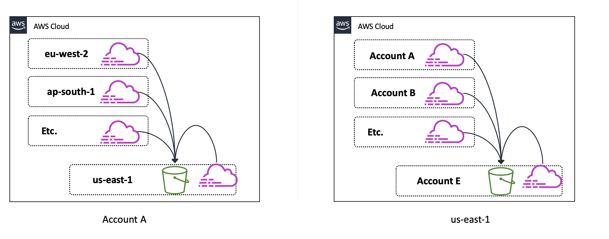

# AWS CloudTrail


Track user activity and API usage in your AWS account

- Continuously monitor user activities and record API calls
- Useful for compliance auditing, security analysis, and troubleshooting
- Log files are delivered to Amazon S3 buckets


<!--

AWS CloudTrail is a service that enables governance, compliance, operational auditing, and risk auditing of your AWS account. With CloudTrail, you can log, continuously monitor, and retain account activity and API usage related to actions across your AWS account. Any security detective would love CloudTrail as a service.

CloudTrail can smooth the progress of compliance reporting for enterprises using AWS that require tracking the API calls for one or more AWS accounts. This service can also be configured to maintain security information and event management (SIEM) and resource management. With CloudTrail, it is easy to get a history of AWS API calls for your account, including API calls made via the AWS Management Console, AWS SDKs, command line tools, and higher level AWS services (such as AWS CloudFormation). The AWS API call records that CloudTrail gives enable security examination, resource transformation tracking, and compliance auditing.

CloudTrail is enabled by default on your AWS account. You can use the AWS API call history that CloudTrail produces to track changes to AWS resources, including creation, modification, and deletion. CloudTrail log files containing the information recorded are delivered to Amazon Simple Storage Service (Amazon S3) buckets.

-->

# AWS CloudTrail


- Capture
- Store
    - s3
    - cloudwatch log
- Act
    - Cloudwatch alarm
    - SNS
- Review


> Cloudtrail is free (management events for first trail), you will pay for storage or AWS SNS.

# AWS CloudTrail


- Who?
    - Who made the API call?
- Where?
    - Where was the API call made from?
- What?
    - What was the API call, and what resources were affected?
- When?
    - When was the API call made?

# AWS CloudTrail


Who

```
{
    "Records": [{
        "eventVersion": "1.0",
        "userIdentity": {
            "type": "IAMUser",
            "principalId": "EX_PRINCIPAL_ID",
            "arn": "arn:aws:iam::123456789012:user/Alice",
            "accountId": "123456789012",
            "accessKeyId": "EXAMPLE_KEY_ID",
            "userName": "Alice"
        },
```

# AWS CloudTrail


When and Where

```
"eventTime": "2019-03-06T21:01:59Z",
        "eventSource": "ec2.amazonaws.com",
        "eventName": "StopInstances",
        "awsRegion": "us-west-2",
        "sourceIPAddress": "205.251.233.176",
        "userAgent": "ec2-api-tools 1.6.12.2",
```

# AWS CloudTrail


What

```
 "requestParameters": {
       "instancesSet": {
           "items": [{
                "instanceId": "i-ebeaf9e2"
           } ] },
      "force": false },
```

#

```
"responseElements": {
    "instancesSet": {
        "items": [{
            "instanceId": "i-ebeaf9e2",
            "currentState": {
                "code": 64,
                "name": "stopping” },
            "previousState": {
                "code": 16,
                "name": "running” } } ] },
```


# AWS CloudTrail


Security of logs

- Encryption
- Signature

<!--

Cloudtrail has integrety check, AWS uses sha2 hashing and sha2 rsa digital signature, and uses KMS for encyption

-->

# AWS CloudTrail

Log consolidation



<!--

Users who need to further archive, analyze, and respond to changes in your AWS resources can create a CloudTrail “trail” that sends log files to a designated Amazon S3 bucket. You can either create a trail that applies to all regions, or to one region. When creating a trail that applies to all regions, CloudTrail creates the same trail in each region, records the log files in each region, and delivers the log files to a single S3 bucket. Each region may have up to five trails. You may also deliver logs from multiple accounts into one account’s S3 bucket. When you enable CloudTrail in an AWS account, every API call invoked across the account is recorded and logged into a specified S3 bucket as part of the established trail. These two types of deployments are known as Many-to-one centralization.

-->

# AWS CloudTrail


AWS CloudTrail best practices

- Send all CloudTrail logs to Amazon S3 for storage and log retention
- Centralize collecting of logs to a dedicated account
- Enforce least privilege principle
- Enforce MFA delete on the log S3 bucket
- Enable Amazon S3 versioning

<!--

CloudTrail is enabled on your AWS account when you create it. When activity occurs in your AWS account, that activity is recorded in a CloudTrail event. You can easily view recent events in the CloudTrail console by going to Event history. In order to ensure that you provide the correct balance of security and operational flexibility, we recommend the following best practices when using CloudTrail:
- CloudTrail logs should be sent to an S3 bucket to take advantage of the S3 lifecycle policy.
- Centralize the collection of logs by using a dedicated AWS ‘Audit account’ for the purpose of log aggregation, separate from other resource accounts. This allows a more simplified and less operationally complex approach to the security control.
- Always enforce the least privilege principle for logging buckets.
- Enforce MFA delete on the CloudTrail S3 bucket to ensure that files cannot be removed or tampered with.
- We recommend enabling versions in the S3 bucket so no one can overwrite a log with a modified log file. 

-->
