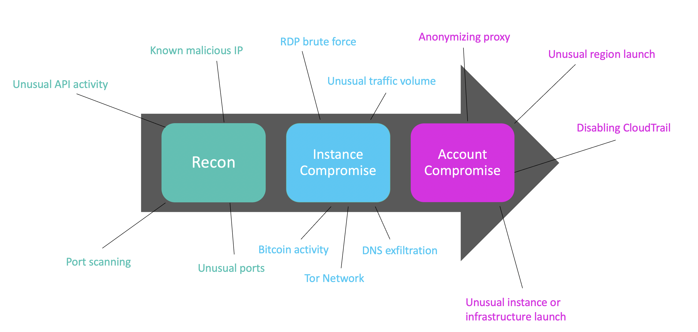

# AWS GuardDuty

- Intelligent threat detection and continuous monitoring to protect AWS accounts and workloads
- Identifies suspected attackers through integrated threat intelligence feeds
- Uses machine learning to detect anomalies

<!--

Amazon GuardDuty is an intelligent threat detection service that provides customers with a way to continuously monitor and protect their AWS accounts and workloads. GuardDuty identifies suspected attackers through integrated threat intelligence feeds and uses machine learning to detect anomalies in account and workload activity. It monitors for activity such as unusual API calls or unauthorized deployments that indicate a customer’s accounts may have been compromised, as well as direct threats like compromised instances or reconnaissance by attackers. When a potential threat is detected, the service delivers a detailed security alert to the GuardDuty console and AWS CloudWatch Events. This makes alerts actionable and capable of integrating into existing event management and workflow systems.

-->

# AWS GuardDuty

- S3 event logs
- CloudTrail logs
- VPC Flow logs
- DNS logs
- EKS (kubernetes) ***NEW***

# AWS GuardDuty

<!--

Amazon GuardDuty gives you access to built-in detection techniques that are developed and optimized for the cloud. The detection algorithms are maintained and continuously improved upon by AWS Security. The primary detection categories include:

- Reconnaissance: Activity suggesting reconnaissance by an attacker, such as unusual API activity, intra-VPC port scanning, unusual patterns of failed login requests, or unblocked port probing from a known bad IP.
- Instance compromise: Activity indicating an instance compromise, such as cryptocurrency mining, malware using domain generation algorithms (DGA), outbound denial of service activity, unusually high volume of network traffic, unusual network protocols, outbound instance communication with a known malicious IP, temporary Amazon EC2 credentials used by an external IP address, and data exfiltration using DNS. There are two new Tor Network-related findings that expand the service’s ability to detect Amazon EC2 instances that may have been compromised and are communicating with the Tor Network. And another new cryptocurrency finding expands the service’s ability to detect Amazon EC2 instances querying IP addresses associated with cryptocurrency-related activity.
- Account compromise: Common patterns indicative of account compromise include API calls from an unusual geolocation or anonymizing proxy, attempts to disable AWS CloudTrail logging, unusual instance or infrastructure launches, infrastructure deployments in an unusual region, and API calls from known malicious IP addresses.

-->
