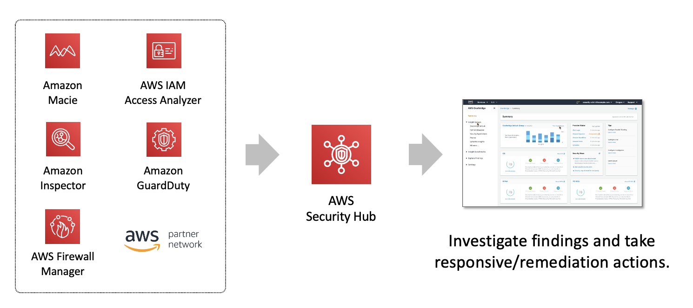

# AWS Security Hub

- Fully managed service
- Consolidates security findings across accounts, services, and third-party products
- Collects and prioritizes findings based on your security and compliance requirements

<!--

AWS Security Hub is a fully managed service that provides you with a comprehensive view of your security state in AWS with the security industry standards and best practices. Security Hub collects security data from across AWS accounts, services, and supported third-party partner products and helps you analyze your security trends and identify the highest priority security issues. This lets you view the current status of the security and compliance checks to spot trends, identify potential issues, and take the necessary remediation steps.

-->

# AWS Security Hub

<!--

AWS Security Hub automatically collects and ingests findings from AWS partner integrations and certain AWS services like GuardDuty, Amazon Inspector, Firewall Manger, IAM Access Analyzer, and Macie using a standard data format, eliminating the need for time-consuming data conversion efforts. A finding is a potential security issue. For example, the IAM Access Analyzer integration with Security Hub sends findings to Security Hub when policies allow public or cross-account access to resources. Security Hub will automatically enable this integration if you are already using IAM Access Analyzer.

Another example is AWS Firewall Manager’s integration with Security Hub, which will send four types of findings to Security Hub:
- Resources that are not properly protected by AWS WAF rules
- Resources that are not properly protected by AWS Shield Advanced
- AWS Shield Advanced findings that indicate a Distributed Denial of Service (DDos) attack is underway
- Security groups that are being used incorrectly

AWS Security Hub generates pre-built dashboards, which provide summaries of key security and compliance status and trends, simplifying the process of monitoring and visualizing security issues.

-->

# AWS Security Hub

- Update the score every 24 hours
