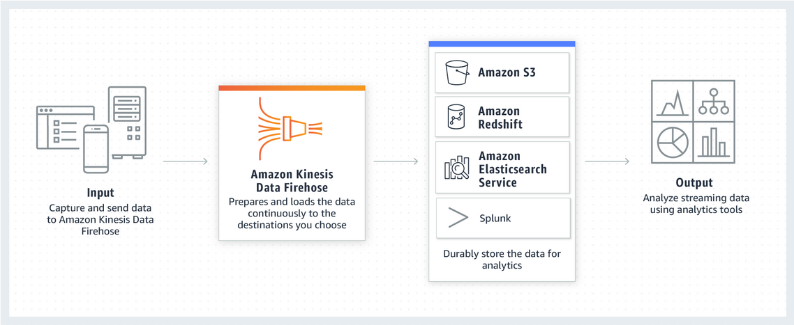

# AWS Kinesis

Picture courtesy: https://aws.amazon.com/kinesis/

<!-- Presenter Note

Amazon Kinesis makes it easy to collect, process, and analyze real-time, streaming data so you can get timely insights and react quickly to new information. Amazon Kinesis offers key capabilities to cost-effectively process streaming data at any scale, along with the flexibility to choose the tools that best suit the requirements of your application. With Amazon Kinesis, you can ingest real-time data such as video, audio, application logs, website clickstreams, and IoT telemetry data for machine learning, analytics, and other applications. Amazon Kinesis enables you to process and analyze data as it arrives and respond instantly instead of having to wait until all your data is collected before the processing can begin.

STORY: Use a Kinesis Agent on a Windows machine to send data to Kinesis application that will convert the format to JSON and then send it to Sentinel
-->

# What is AWS Kinesis?

- Service offered by AWS to obtain log data, perform analysis or process it.
- There are different input stream types supported by AWS Kinesis (For eg. video streams, data streams, logs etc)
- Either setup a stream from an AWS resource or use a Kinesis Agent (Linux/Windows supported)
- Mainly intended to be a stream processing solution for real-time or near-real-time data
- Kinesis data streams has high availability and supports auto scaling

# Concepts

Picture courtesy: https://docs.aws.amazon.com/streams/latest/dev/key-concepts.html

# Concepts

- Producer = Puts data into Kinesis
- Consumer = Gets data from Kinesis
- Data stream > Shard > Data record > Data blob

# Kinesis use cases

- Streaming log intake
- Real-time data analysis and processing
- Mixing different streams
- Converting log formats on the go
