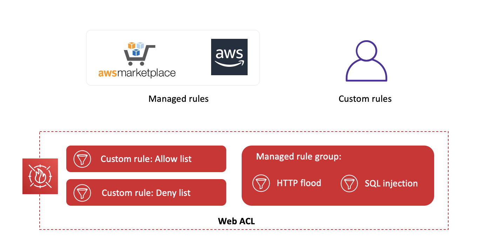

# AWS WAF

Helps detect and block malicious web requests targeted at your web applications

- Web traffic filtering
- Real-time metrics 
- Application layer protection
- Integrates with Amazon CloudFront, Amazon API Gateway, and ALBs

<!--

When it comes to security and threat protection against DDoS attacks, environments on AWS can use several services designed to provide protection and high availability to web applications and data. AWS WAF is a web application firewall that helps detect and block malicious web requests targeted at your web applications. AWS WAF lets you create rules to filter web traffic based on conditions, which include IP addresses, HTTP headers and body, or custom URIs. 

This gives you an additional layer of protection from web attacks that attempt to exploit vulnerabilities in custom or third-party web applications. In addition, AWS WAF provides real-time metrics and captures raw requests that include details about IP addresses, geo locations, etc. AWS WAF provides application layer protection and is tightly integrated with Amazon CloudFront, Amazon API Gateway, and the Application Load Balancer. These are services that AWS customers commonly use to deliver content for their websites and applications. 

When you use AWS WAF on Amazon CloudFront, your rules run in all AWS Edge Locations, located around the world close to your end users. This means security doesn’t come at the expense of performance. Blocked requests are stopped before they reach your web servers. When you use AWS WAF on Application Load Balancer, your rules run in region and can be used to protect internet-facing as well as internal load balancers.

-->

# AWS WAF

What can you do?

- Create a web ACL and add rules
- Block and filter unwanted traffic
- Monitor traffic and log data

<!--
Web access control lists (ACL) are used to protect a set of AWS resources. You create a web ACL and define its protection strategy by adding rules. Rules define criteria for inspecting web requests and specify how to handle requests that match the criteria. You set a default action for the web ACL that indicates whether to block or allow through those requests that pass the rules inspections. You can create a web access control list (ACL) using the AWS WAF console and rules that you want to use to block and filter web requests. This is where you specify whether you want to block web requests or allow them. If a web ACL has more than one rule, web requests must satisfy just one of the rules. AWS WAF evaluates the rules in the order that they're listed in the web ACL. 

AWS WAF includes two different ways to see how your website is being protected: one-minute metrics are available in CloudWatch and Sampled Web Requests are available in the AWS WAF API or management console. These allow you to see which requests were blocked, allowed, or counted and what rule was matched on a given request (i.e., this web request was blocked due to an IP address condition, etc.). 

-->

# AWS WAF

How can you do? 

- IP address origin of the request
- Country of origin of the request
- String match or regular expression (regex) match in a part of the request
- Size of a particular part of the request
- Detection of malicious SQL code or scripting
- AND, OR, NOT
- Number of requests in any period

https://docs.aws.amazon.com/waf/latest/developerguide/waf-rule-statements-list.html

<!-- 

You can use criteria like the following to allow or block requests:
- IP address origin of the request
- Country of origin of the request
- String match or regular expression (regex) match in a part of the request
- Size of a particular part of the request
- Detection of malicious SQL code or scripting

You can also test for any combination of these conditions. You can block or count web requests that not only meet the specified conditions, but also exceed a specified number of requests in any 5-minute period. You can combine conditions using logical operators. This criteria is provided inside the rules that you include in your web ACL and in rule groups that you use in the web ACL. It's specified in the rule statement. 

For a full list of the options, see https://docs.aws.amazon.com/waf/latest/developerguide/waf-rule-statements-list.html.

-->

# AWS WAF

<!--
Web access control lists (ACL) are used to protect a set of AWS resources. You create a web ACL and define its protection strategy by adding rules. Rules define criteria for inspecting web requests and specify how to handle requests that match the criteria. You set a default action for the web ACL that indicates whether to block or allow through those requests that pass the rules inspections. You can create a web access control list (ACL) using the AWS WAF console and rules that you want to use to block and filter web requests. This is where you specify whether you want to block web requests or allow them. If a web ACL has more than one rule, web requests must satisfy just one of the rules. AWS WAF evaluates the rules in the order that they're listed in the web ACL. 

Each AWS WAF rule contains a statement with conditions that define the inspection criteria, and an action to take if a web request meets the criteria. When a web request meets the criteria, that's a match. You can use rules to block matching requests or to allow matching requests through. You can also use rules just to count matching requests. 

AWS WAF supports both managed and custom rules. Managed rules are a set of rules written, curated and managed by AWS and AWS Marketplace Sellers that can be used quickly get started and protect your web application or APIs against common threats. You can use rules individually or in reusable rule groups. AWS Managed Rules rule groups are available for free to AWS WAF customers. 

AWS Marketplace managed rule groups are available by subscription through AWS Marketplace. After you create your web ACL, you can associate it with one or more AWS resources. Managed rules can be used along with your custom AWS WAF rules. You can add managed rules to your existing web ACL to which you might have already added your own rules. If you add more than one rule to a web ACL, AWS WAF evaluates each request against the rules in the order that you list them in the web ACL. If you add a rule group to your web ACL, AWS WAF processes the rule group in the order that it's listed in the web ACL and processes the rules in the rule group in the order that they're listed inside that.

The web ACL rule displayed here contains two custom rules that allow you to manually insert IP addresses that you want to block (deny list) or allow (allow list). It also contains a managed rule group made of two rules. The HTTP flood rule protects against attacks that consist of a large number of requests from a particular IP address, such as a web-layer DDoS attack or a brute-force login attempt.  The SQL injection rule is designed to protect against common SQL injection patterns in the URI, query string, or body of a request.

Rule groups and web ACLs both contain rules, which are defined in the same manner in both places. They are different in the following ways:
You can reuse a single rule group in multiple web ACLs by adding a rule group reference statement to each web ACL. You can't reuse a web ACL.
Rule groups don't have default actions. In a web ACL, you set a default action for each rule or rule group that you include. Each individual rule inside a rule group or web ACL has an action defined.
You don't directly associate a rule group with an AWS resource. To protect resources using a rule group, you use the rule group in a web ACL.

-->