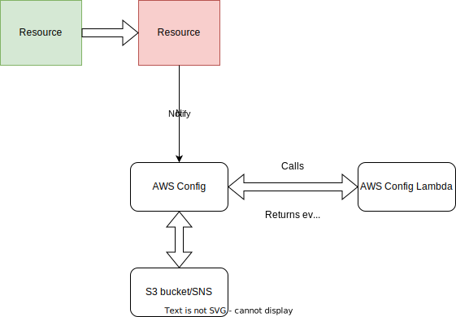

# AWS Config

Picture courtesy: https://aws.amazon.com/config/

<!-- Presenter Note

AWS Config is a service that enables you to assess, audit, and evaluate the configurations of your AWS resources. Config continuously monitors and records your AWS resource configurations and allows you to automate the evaluation of recorded configurations against desired configurations. With Config, you can review changes in configurations and relationships between AWS resources, dive into detailed resource configuration histories, and determine your overall compliance against the configurations specified in your internal guidelines. This enables you to simplify compliance auditing, security analysis, change management, and operational troubleshooting.
-->

# What is AWS Config?

- Service offered by AWS to track changes across different resources
- Allows you to monitor changes in the configuration of resources
- You can either send these to an S3 bucket or send an SNS message based on certain rules
- Set your own rules or use predefined Managed Rules
- When a resource is changed, the associated AWS Config rule is evoked.
	- You can also choose a periodic check instead
- Config also supports auto or manual remediation via Systems Manager Automation

# How AWS Config works

# Key concepts

- Configuration item = Collection of attributes about a resource at a point in time
- Configuration recorder = Records the configuration items of the resources. By default all the resources in the region is selected but you can customize this
- Managed rules = Rules provided by AWS for regular use (For eg: Checks if CloudTrail is enabled or not)
- Custom rules = Rules that you write for AWS Config
- Remediation action = Automated or manual "fixes" for configuration issues
- Conformance pack = List of rules and remediation actions that can be deployed together

# Configuring AWS Config

1. Choose type of resource type to record.
2. Choose role for AWS Config to run.
3. Create a Lambda function for evaluation
4. Link the Lambda function to the Config rule via the Lambda ARN
5. Choose delivery method (Deliver to an S3 bucket or send message via SNS).